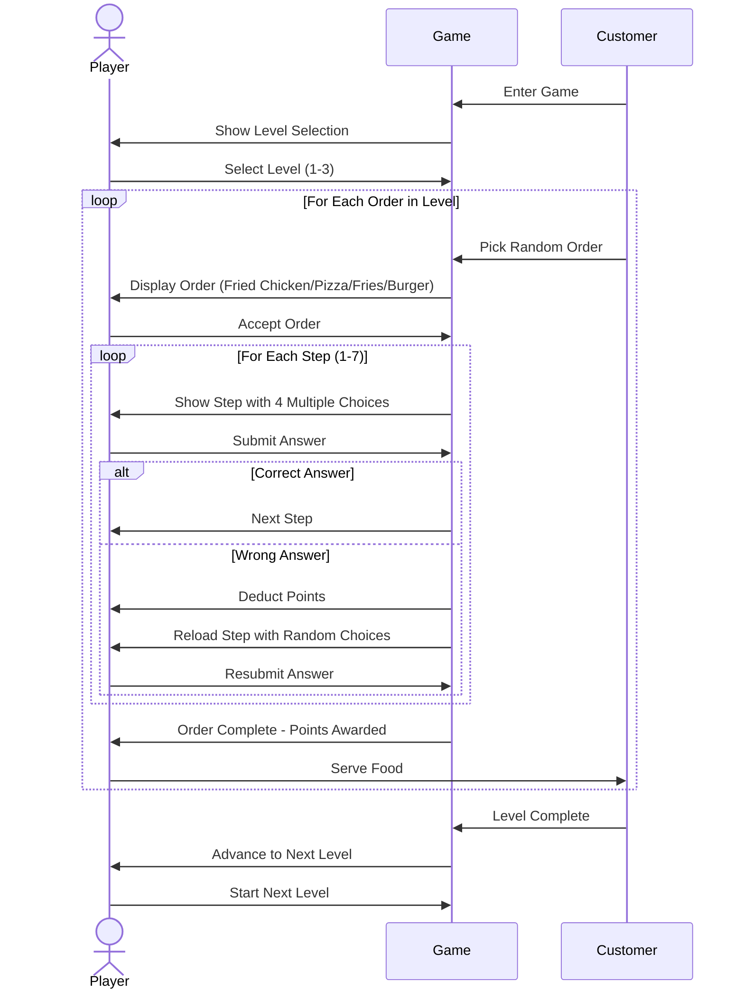

# Chef-Mode-On

```
---
config:
  layout: elk
---
flowchart TD
  subgraph Customer_Part["Customer Progression"]
    A1["Level 1: 1 Order"]
    A2["Level 2: 2 Orders"]
    A3["Level 3: 3 Orders"]
    A1 --> A2 --> A3
  end

  subgraph Cooking_Main["Cooking Main Sequence"]
    B1["Customer In"]
    B2["Customer Order"]
    B3["Player Chooses Order Type"]
    B4["Show Steps (1–7)"]
    B5["Step N: Multiple Choice (A, B, C, D)"]
    B6["Choice?"]
    B7["Wrong → Deduct Points & Retry Step"]
    B8["Right → Next Step"]
    B9["Complete All Steps → Order Ready!"]

    B1 --> B2 --> B3 --> B4 --> B5 --> B6
    B6 -->|Wrong| B7 --> B5
    B6 -->|Right| B8 --> B5
    B8 -.->|Until last step| B9
  end

  subgraph Menu["Menu Items"]
    C1["Fried Chicken (7 Steps)"]
    C2["Pizza (7 Steps)"]
    C3["Fries (7 Steps)"]
    C4["Burger (7 Steps)"]
  end

  %% Connections between major parts
  A1 -.-> B1
  A2 -.-> B1
  A3 -.-> B1
  B3 --> Menu
  Menu --> B4
  B9 --> A2
  A3 -->|Game Progression| B1

  %% Styling
  classDef customer fill:#ecfeff,stroke:#22d3ee,stroke-width:2px;
  classDef cooking fill:#f0fdf4,stroke:#4ade80,stroke-width:2px;
  classDef menu fill:#fefce8,stroke:#facc15,stroke-width:2px;

  class Customer_Part,A1,A2,A3 customer;
  class Cooking_Main,B1,B2,B3,B4,B5,B6,B7,B8,B9 cooking;
  class Menu,C1,C2,C3,C4 menu;
```

