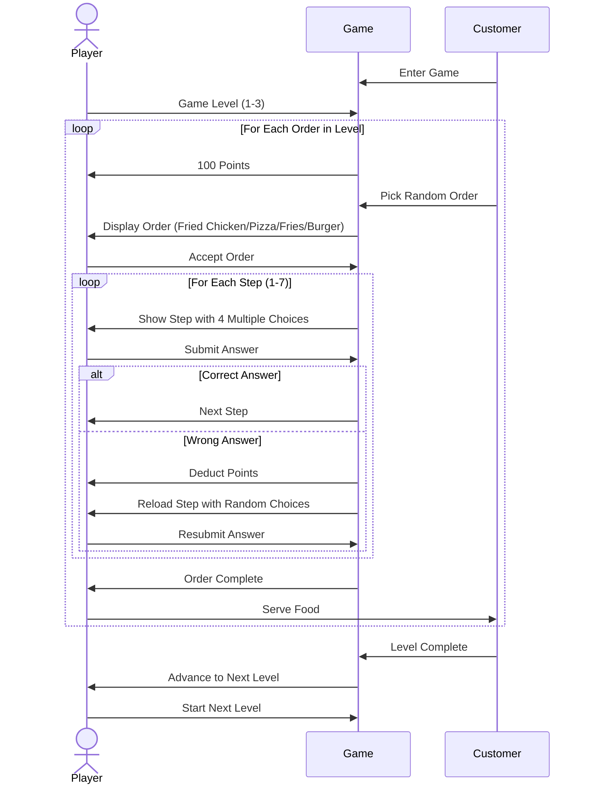
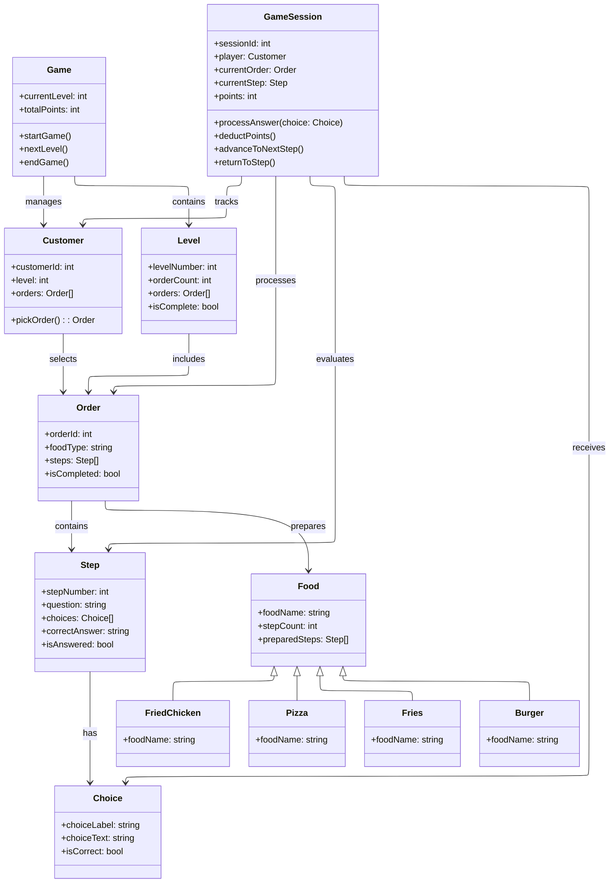

# Chef-Mode-On

```mermaid
sequenceDiagram
 actor Player
    participant Game
    participant Customer
    Customer->>Game: Enter Game
    Player->>Game:  Game Level (1-3)
   
    loop For Each Order in Level
     Game->>Player: 100 Points
        Customer->>Game: Pick Random Order
        Game->>Player: Display Order (Fried Chicken/Pizza/Fries/Burger)
        Player->>Game: Accept Order
        loop For Each Step (1-7)
            Game->>Player: Show Step with 4 Multiple Choices
            Player->>Game: Submit Answer
            alt Correct Answer
                Game->>Player: Next Step
            else Wrong Answer
                Game->>Player: Deduct Points
            
                Game->>Player: Reload Step with Random Choices
                Player->>Game: Resubmit Answer
            
            end
        end
        Game->>Player: Order Complete 
        Player->>Customer: Serve Food
    end
    Customer->>Game: Level Complete
    Game->>Player: Advance to Next Level
    Player->>Game: Start Next Level

```

```mermaid

---
config:
  layout: elk
---
classDiagram
    class Game {
        +currentLevel: int
        +totalPoints: int
        +startGame()
        +nextLevel()
        +endGame()
    }

    class Customer {
        +customerId: int
        +level: int
        +orders: Order[]
        +pickOrder(): Order
    }

    class Level {
        +levelNumber: int
        +orderCount: int
        +orders: Order[]
        +isComplete: bool
    }

    class Order {
        +orderId: int
        +foodType: string
        +steps: Step[]
        +isCompleted: bool
    }

    class Step {
        +stepNumber: int
        +question: string
        +choices: Choice[]
        +correctAnswer: string
        +isAnswered: bool
    }

    class Choice {
        +choiceLabel: string
        +choiceText: string
        +isCorrect: bool
    }

    class Food {
        +foodName: string
        +stepCount: int
        +preparedSteps: Step[]
    }

    class FriedChicken {
        +foodName: string
    }

    class Pizza {
        +foodName: string
    }

    class Fries {
        +foodName: string
    }

    class Burger {
        +foodName: string
    }

    class GameSession {
        +sessionId: int
        +player: Customer
        +currentOrder: Order
        +currentStep: Step
        +points: int
        +processAnswer(choice: Choice)
        +deductPoints()
        +advanceToNextStep()
        +returnToStep()
    }

    Game --> Customer: manages
    Game --> Level: contains
    Level --> Order: includes
    Customer --> Order: selects
    Order --> Step: contains
    Step --> Choice: has
    Order --> Food: prepares
    Food <|-- FriedChicken
    Food <|-- Pizza
    Food <|-- Fries
    Food <|-- Burger
    GameSession --> Customer: tracks
    GameSession --> Order: processes
    GameSession --> Step: evaluates
    GameSession --> Choice: receives
```

