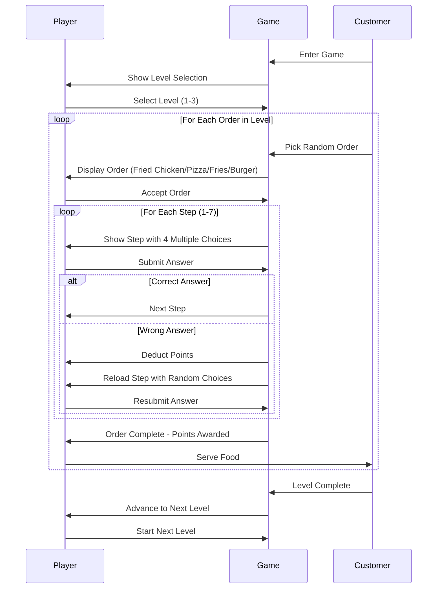

# Chef-Mode-On

```mermaid
sequenceDiagram
    participant Player
    participant Game
    participant Customer
    
    Customer->>Game: Enter Game
    Game->>Player: Show Level Selection
    Player->>Game: Select Level (1-3)
    
    loop For Each Order in Level
        Customer->>Game: Pick Random Order
        Game->>Player: Display Order (Fried Chicken/Pizza/Fries/Burger)
        Player->>Game: Accept Order
        
        loop For Each Step (1-7)
            Game->>Player: Show Step with 4 Multiple Choices
            Player->>Game: Submit Answer
            
            alt Correct Answer
                Game->>Player: Next Step
            else Wrong Answer
                Game->>Player: Deduct Points
                Game->>Player: Reload Step with Random Choices
                Player->>Game: Resubmit Answer
            end
        end
        
        Game->>Player: Order Complete - Points Awarded
        Player->>Customer: Serve Food
    end
    
    Customer->>Game: Level Complete
    Game->>Player: Advance to Next Level
    Player->>Game: Start Next Level


```
